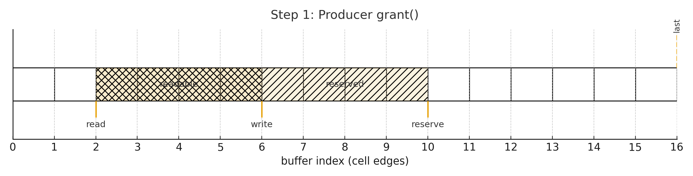
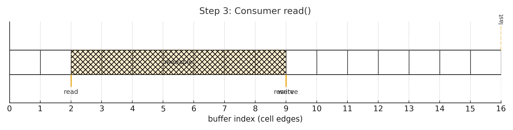
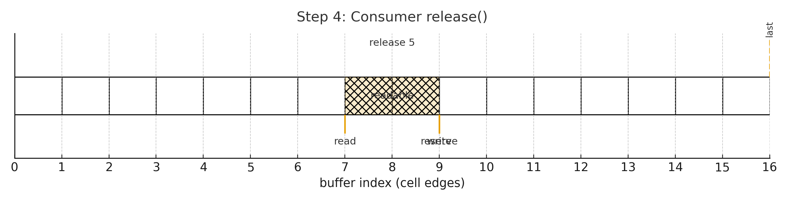

# BBQueue の理解
どのようなコンセプトでどういう問題をクリアしたライブラリなのかを理解する。

## 概要
SPSCのロックフリー循環バッファ (+ no_std)

### ロックについて整理
- ロック (mutex、semaphore 等)

相互排他のために所有権を取れない側を待たせる

- アトミック

CPU の提供する不可分操作を利用する。

BBQueue はアトミック (とメモリバリア) を使い、ロックは使わずにデータ競合を回避しているため、「ロックフリー」といえる。ただし、ProducerとConsumerの状況には依存して待ちが発生しないとは言えないので、「ウェイトフリー」ではない。

ロックフリーなので、相手方の都合で実質的に処理が進めない (Consumerが読めるデータがない) 場合でも待たされない。しかし、結局BBQueue使用者側にリトライ、スリープ、ロックなどの戦略を外出ししているだけとも言える。

### BBQueue の機能的利点について整理
類似の概念として既存の循環バッファ、BipBuffer などがある。

BipBufferとは基本的なバッファ管理方式は同じ。

原始的な循環バッファは使用者側に返す領域が連続領域かどうか保証しない。

BipBufferは保証する。そのため、メモリマップ、DMAと相性が良い。

BBQueueはこの利点についてはBipBufferと同様になる。

BBQueueはBipBufferの一実装であり、SPSCなどスレッド周りの管理や、APIなどを整備してRustライブラリとして使いやすくしている。

## 動作理解
### Atomic変数
- The value of the shared `write` AtomicUsize. 次に書き込む位置。
- The value of the shared `read` AtomicUsize. 次に読みだされる位置
- The value of the shared `last` AtomicUsize. Bufferが循環した際に、読み込み可能な位置を示す。
- The value of the shared `reserve` AtomicUsize. Writerが書き込み可能な位置を示す。まだreadはできない。
- The value of the shared `already_split` AtomicBool. 初期化済みかを示す。
- The value of the shared `read_in_progress` AtomicBool. ConsumerにactiveなGrantがあるかを示す。
- The value of the shared `write_in_progress` AtomicBool. ProducerにactiveなGrantがあるかを示す。

### 操作
1. Producerがgrant(usize)を行う
write_in_progressをtrueに*更新*する。
write位置を決める。(Invert確認などを行う)
reserve値を*更新*する。
(空きがない場合にはエラーになるが、詳細は省略)

ProducerはGrantWを得て、その中にはBufferのslice (write ~ reserve) が入っており、読み書きができる。

2. Producerがcommitを行う
write_in_progressをfalseに*更新*する。
reserve位置を使った分に応じて戻して*更新*する。(使わなかった分を返す)
last位置を*更新*する。 (wrapした場合は前のwriteがlastになる。reserveがlastを追い越したら、lastは最後の位置にする、など)
write位置をreserveの値で*更新*する。

3. Consumerがread()を行う
read_in_progressをtrueに*更新*する。
read位置を*更新*する。
write, last, read の値をチェックし、wrapを検知したらread値を0に*更新*する。

Consumerはinvertしていたら read ~ lastまで、していなければ read ~ write間のsliceを得る。

4. Consumerがrelease()を行う
read_in_progressをfalseに*更新*する。
read位置を読んだ分だけ*更新*する。

### ざっくり理解
ロックを使わず、bufferの領域をProducerとConsumerで排他的に利用させることでデータ競合を防いでいる。

## 何を検証するのか？
上記操作が正しく動くこと。すなわち、書かれたものが正しく読めること。
- データ競合などが起きない。

## どう検証するのか。
VerusのTokenized State Machinesを使う。
https://verus-lang.github.io/verus/state_machines/tokenized.html
https://verus-lang.github.io/verus/state_machines/high-level-idea.html

## 実例
SPSCの循環キューの例があった。
https://verus-lang.github.io/verus/state_machines/examples/producer-consumer-queue.html

これはSPSCの状態と遷移を以下のように定義し、形式化した上で検証している。

### 管理すべき状態
- The value of the shared `head` atomic
- The value of the shared `tail` atomic
- The producer’s state
    Is the producer step in progress?
    Local `tail` field saved by the producer
- The consumer’s state
    Is the consumer step in progress?
    Local `head` field saved by the producer
- The IDs of cells in the buffer (so we know what permissions we’re meant to be storing)
- The permissions that are actually stored.

### 検証が必要な操作
dequeue が想定通りの型のデータを返すことを保証する。

### 状態遷移
- produce_start
- produce_end
- consume_start
- consume_end

## BBQueueに適用すると？
実は結構似ている。
上記の例も *ロックフリー循環キュー* のアルゴリズムである。
grantとcommitが一緒になっている点が違う。
1セル書き込み固定だが、複数指定が可能な点が違う。

### 管理すべき状態
- The value of the shared `write` AtomicUsize
- The value of the shared `read` AtomicUsize
- The value of the shared `last` AtomicUsize
- The value of the shared `reserve` AtomicUsize
- The value of the shared `already_split` AtomicBool
- The value of the shared `read_in_progress` AtomicBool
- The value of the shared `write_in_progress` AtomicBool
- The producer’s state
    Local `write`, `last`, `reserve`
- The consumer’s state
    Local `write`, `last`, `read`
- The buffer (PCell)
- The permissions (PointsTo)

### 検証が必要な操作
read が想定通りの型のデータを返すことを保証する。

### 状態遷移
- write_grant_start
- write_grant_end
- commit_start
- commit_end
- read_grant_start
- read_grant_end
- release_start
- release_end
